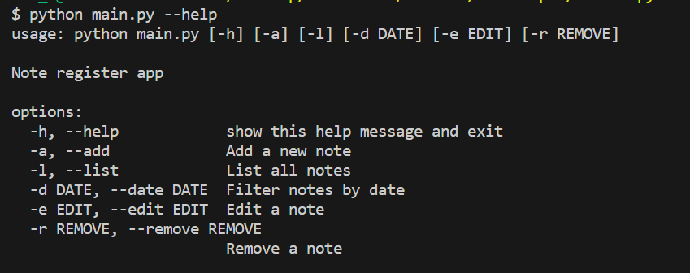
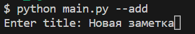
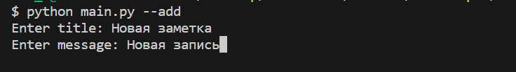
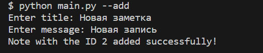
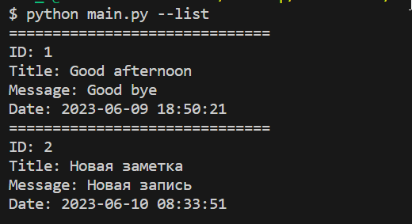
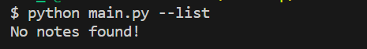
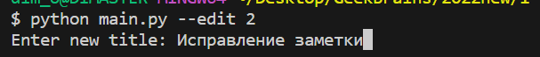
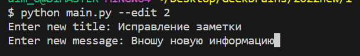
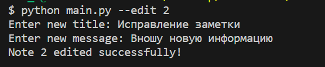
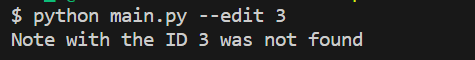

## Задание 1. Приложение заметки (Python)
### Информация о проекте
Необходимо написать проект, содержащий функционал работы с заметками.
Программа должна уметь создавать заметку, сохранять её, читать список
заметок, редактировать заметку, удалять заметку
___
### Как сдавать проект
Для сдачи проекта необходимо создать отдельный общедоступный
репозиторий (Github, gitlub, или Bitbucket). Разработку вести в этом
репозитории, использовать пул реквесты на изменения. Программа должна
запускаться и работать, ошибок при выполнении программы быть не должно.
___
### Задание
Реализовать консольное приложение заметки, с сохранением, чтением,
добавлением, редактированием и удалением заметок. Заметка должна
содержать идентификатор, заголовок, тело заметки и дату/время создания или
последнего изменения заметки. Сохранение заметок необходимо сделать в
формате json или csv формат (разделение полей рекомендуется делать через
точку с запятой). Реализацию пользовательского интерфейса студент может
делать как ему удобнее, можно делать как параметры запуска программы
(команда, данные), можно делать как запрос команды с консоли и
последующим вводом данных, как-то ещё, на усмотрение студента.Например:
python notes.py add --title "новая заметка" –msg "тело новой заметки"
___
## РЕШЕНИЕ
Библиотеки для решения задачи:
* argparse
* json
* datetime
* os

Было принято решение использовать библиотеку argparse. Модуль argparse позволяет разбирать аргументы, передаваемые скрипту при его запуске из командной строки, и даёт возможность пользоваться этими аргументами в скрипте.

## Общий функционал
Чтобы увидеть список доступных команд, необходимо в терминале набрать команду: **python main.py --help**

### 1. Добавление заметки в блокнот

Для добавления заметки в блокнот в терминале необходимо ввести команду **python main.py --add** или **python main.py -a**
Появится предложение ввести название новой заметки:

Вводим новое сообщение:

В результате появится сообщение об успешном добавлении новой записи:

### ВАЖНО:
Все заметки сохраняются в файл **_notes.json_**.
Если данного файла нет изначально, он будет сразу создан при добавлении новой записи.

### 2. Просмотр всех заметок в блокноте

Для просмотра всех заметок в блокноте необходимо в терминале ввести команду **python main.py --list** или **python main.py -l**

### ВАЖНО:
Если изначально список заметки пустой, появится соответствующее сообщение:

### 3. Редактирование существующей заметки

Для редактирования существующей заметки необходимо в терминале ввести команду **python main.py --edit** или **python main.py -e** и выбрать id заметки.

Появится предложение ввести новый заголовок заметки:

А также ввести новое сообщение для заметки:

В результате появится сообщение об успешном изменении записи:

### ВАЖНО:
Если попробовать ввести несуществующий id, появится сообщение, что записи с данным id не существует:

### 4. Удаление заметки
Для удаления

